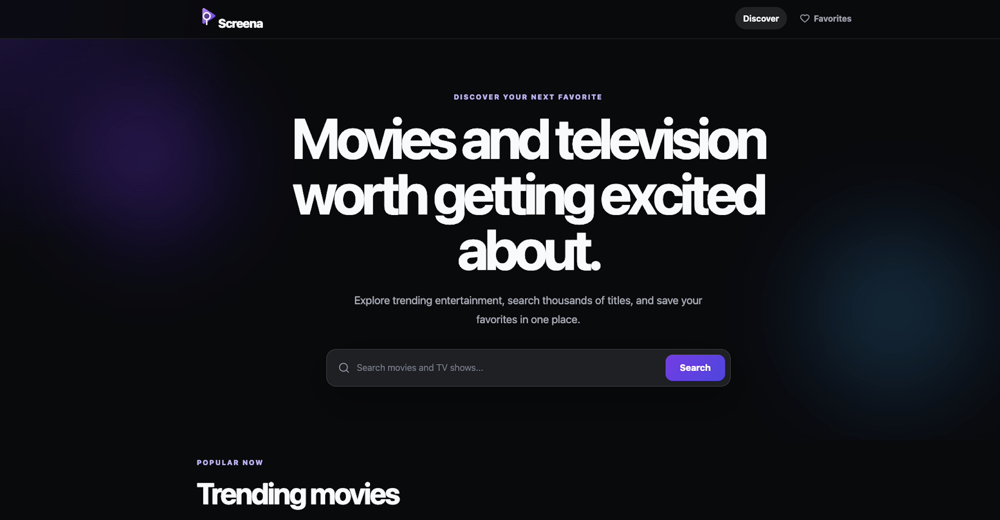
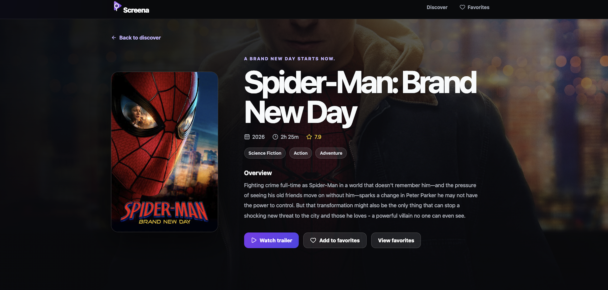

# 🎬 Screena

A responsive React application for discovering movies and TV shows using live data from The Movie Database (TMDB) API. Users can browse trending content, search thousands of titles, save favorites, and explore detailed information about movies and TV shows.

---

## 📸 Preview

> **Homepage**

> **Movie Details**

---

## 🌐 Live Demo

**Live Site:**

https://screena-alpha.vercel.app

**Portfolio:**

https://www.stevenlomax.com 

---

## 📖 Overview

Screena is a front-end React application built to provide an intuitive way to discover movies and television shows using the TMDB API.

The application allows users to:

- Browse trending movies
- Browse trending TV shows
- Search thousands of movies and TV shows
- View detailed information
- Watch official trailers (when available)
- Save favorites
- Discover similar movies and TV shows
- Enjoy a responsive experience across desktop, tablet, and mobile devices

---

## ✨ Features

- 🎬 Trending Movies
- 📺 Trending TV Shows
- 🔍 Search Functionality
- ❤️ Favorites with Local Storage
- 🎥 Official Trailer Links
- 📄 Detailed Movie Pages
- 📄 Detailed TV Show Pages
- 🎯 Similar Movies
- 🎯 Similar TV Shows
- 📱 Fully Responsive Design
- ⚡ Loading States
- 🚫 Error Handling
- 🔀 Client-Side Routing
- 🎨 Custom Branding

---

## 🛠 Built With

- React
- JavaScript (ES6+)
- Vite
- React Router
- Axios
- TMDB API
- Lucide React
- CSS3
- HTML5
- Local Storage API
- Git
- GitHub
- Vercel

---

## 📚 What I Learned

Building Screena strengthened my understanding of:

- Building reusable React components
- React Hooks (useState, useEffect)
- Managing application state
- Client-side routing with React Router
- Consuming REST APIs
- Handling asynchronous JavaScript
- Working with URL parameters
- Persisting data using localStorage
- Creating responsive layouts
- Improving user experience with loading and error states
- Deploying production-ready applications with Vercel

---

## 👨‍💻 Author

**Steve Lomax**  
Front-End Developer

- **Portfolio:** https://www.stevenlomax.com
- **GitHub:** https://github.com/stevelomax1
- **LinkedIn:** https://www.linkedin.com/in/stevelomax1
